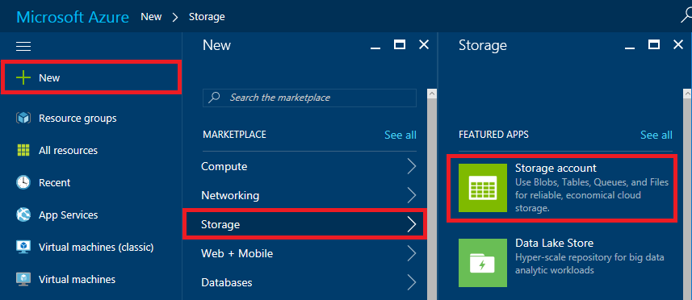
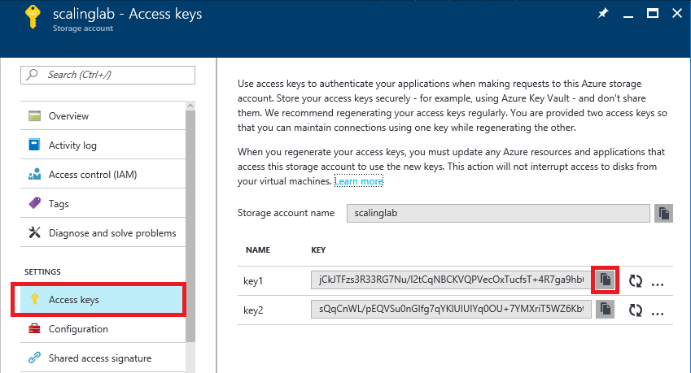
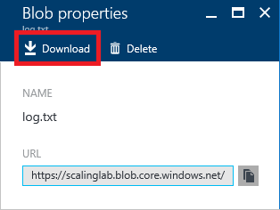
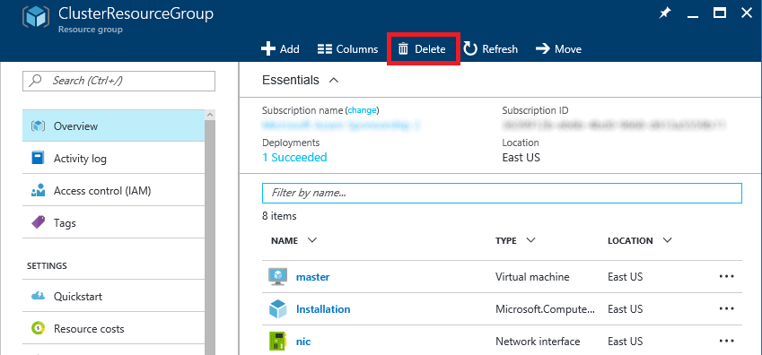
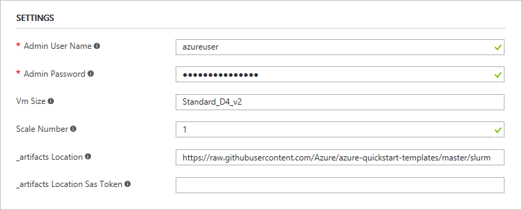
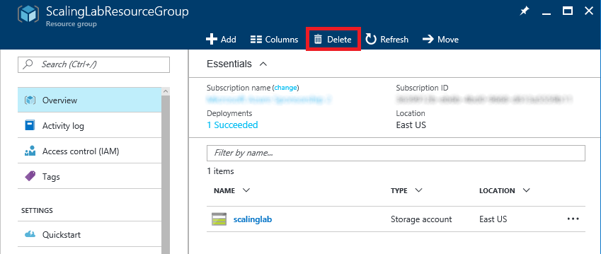

<a name="HOLTitle"></a>
# Virtual Machine Scaling and Performance #

---

<a name="Overview"></a>
## Overview ##

One of the benefits of using the cloud to handle large computing workloads is virtually limitless scalability. In Microsoft Azure, you can create a cluster of virtual machines (VMs) networked to form a high-performance computing (HPC) cluster in a matter of minutes. If you need more computing power than the cluster can provide, you can *scale up* by creating a cluster with larger and more capable virtual machines (more cores, more RAM, etc.), or you can *scale out* by creating a cluster with more nodes. Finding the optimum cluster configuration for a given job is a key requirement for utilizing compute resources effectively and efficiently.

In this hands-on lab, you will run a compute-intensive job on three different Linux HPC clusters and compare performance. The cluster sizes you will use are:

- One worker node with one core and 3.5 GB of RAM
- One worker node with eight cores and 28 GB of RAM
- Eight worker nodes, each with one core and 3.5 GB of RAM

The job that you will run is written in Python, and it involves using the latitudes and longitudes of more than 7,300 airports to build a distance table like the one below containing the distance between each airport. Since the number of distances is the square of the number of airports, the job computes more than 53 million distances, and the calculations are floating-point intensive as well as CPU-intensive because the distances are calculated over the [surface of a sphere](https://en.wikipedia.org/wiki/Great-circle_distance).


_Sample distance table_

To distribute the workload among all the nodes and cores in each cluster, the Python code that you will run uses the [Simple Linux Utility for Resource Management](https://slurm.schedmd.com/), also known as the SLURM Workload Manager or simply SLURM. SLURM is a free and open-source job scheduler for Linux that excels at distributing heavy computing workloads across clusters of machines and processors. It is used on more than half of the world's largest supercomputers and HPC clusters, and it enjoys widespread use in the research community for jobs that require significant compute resources.

This lab normally requires 90 minutes or more to complete because it has you deploy and test three clusters sequentially. You can economize on time by deploying all three clusters in parallel, essentially working Exercises 2, 7, and 8 at the same time. Be aware, however, that some free Azure subscriptions limit the number of virtual-machine cores that can be extant at any one time, so depending on what type of subscription you have, you may or may not be able to deploy three clusters concurrently. 

<a name="Objectives"></a>
### Objectives ###

In this hands-on lab, you will learn how to:

- Create a SLURM cluster in Azure
- Copy local resources to a SLURM cluster
- Remote into a SLURM cluster
- Run jobs on a SLURM cluster
- Use the Azure Resource Manager to delete a SLURM cluster

Moreover, you will get a first-hand look at the differences in performance when scaling up versus scaling out. Of course, every job is different, so the exercises herein provide just one example of the performance differences one can expect.

<a name="Prerequisites"></a>
### Prerequisites ###

The following are required to complete this hands-on lab:

- An active Microsoft Azure subscription, or [sign up for a free trial](https://azure.microsoft.com/en-us/free/)
- [PuTTY](http://www.chiark.greenend.org.uk/~sgtatham/putty/download.html) (Windows users only)

<a name="Exercises"></a>
## Exercises ##

- [Exercise 1: Create a storage account and configure Python scripts](#Exercise1)
- [Exercise 2: Deploy an HPC cluster](#Exercise2)
- [Exercise 3 (macOS and Linux): Connect to and configure the cluster](#Exercise3)
- [Exercise 4 (Windows): Connect to and configure the cluster](#Exercise4)
- [Exercise 5: Run a job and view the results](#Exercise5)
- [Exercise 6: Delete the cluster](#Exercise6)
- [Exercise 7: Test with a cluster containing one worker nodes with eight cores](#Exercise7)
- [Exercise 8: Test with a cluster containing eight worker nodes with one core each](#Exercise8)
- [Exercise 9: Delete the storage account](#Exercise9)

Estimated time to complete this lab: **90 minutes**.

<a name="Exercise1"></a>
## Exercise 1: Create a storage account and configure Python scripts

In this exercise, you will use the [Azure Portal](https://portal.azure.com) to create a storage account. Then you will modify the job scripts used to compare the performance of various VM configurations so they can use this account to store data in blob storage. 

1. Open the [Azure Portal](https://portal.azure.com) in your browser. If you are asked to log in, do so using your Microsoft account.
 
1. Click **+ New** in the ribbon on the left. Then click **Storage**, followed by **Storage account**.

    

    _Creating a storage account_

1. In the ensuing "Create storage account" blade, enter a name for the new storage account in **Name** field. The name is important, because it forms one part of the URL through which blobs created under this account are accessed.

	> Storage account names can be 3 to 24 characters in length and can only contain numbers and lowercase letters. In addition, the name you enter must be unique within Azure. If someone else has chosen the same name, you'll be notified that the name isn't available with a red exclamation mark in the **Name** field.

	Once you have a name that Azure will accept (as indicated by the green check mark in the **Name** field), make sure **Resource manager** is selected as the **Deployment model** and **General purpose** is selected as the **Account kind**. Then select **Create new** under **Resource group** and type "ScalingLabResourceGroup" (without quotation marks) into the box below to name the new resource group that will be created for the storage account. Finish up by selecting the location nearest you in the **Location** box, and clicking the **Create** button at the bottom of the blade to create the new storage account.
    
	

    _Specifying parameters for a new storage account_

1. After the account is created (it generally takes 30 seconds or so), click **Resource groups** in the ribbon on the left side of the portal, and then click the "ScalingLabResourceGroup" resource group that was created along with the storage account.

	

    _Opening the resource group_

1. Click the storage account that you created in Step 3.

	

    _Opening the storage account_

1. Click **Access keys** to display the storage account's access keys, and then click the **Copy** button to the right of the primary key to copy it to the clipboard.

	

    _Copying the access key_
 
1. Find **controller.py** in this lab's "resources" folder and open it in the text or program editor of your choice.

1. In **controller.py**, replace *storage_account_name* on line 14 with the name of the storage account you created in Step 3, and replace *storage_account_key* on line 15 with the access key that is on the clipboard. Then save your changes and close the file.

	

    _Modifying controller.py_

1. Find **worker.py** in this lab's "resources" folder and open it in the text or program editor of your choice.

1. In **worker.py**, replace *storage_account_name* on line 11 with the name of the storage account you created in Step 3, and replace *storage_account_key* on line 12 with the access key that is on the clipboard. Then save your changes and close the file.

You now have an Azure storage account that you can use in your tests as well as Python scripts that can access the storage account. The next step is to deploy your first HPC cluster for testing.

<a name="Exercise2"></a>
## Exercise 2: Deploy an HPC cluster

The Azure Resource Manager allows you to provision applications using declarative templates. A template contains a complete description of everything that makes up the application, including virtual machines, databases, Web apps, IP addresses, and other resources. Templates can include parameters that users are prompted to fill in each time an application is deployed. Templates can also invoke scripts to initialize resources to a known and consistent state. To learn more about Azure Resource Manager templates, refer to the [documentation](https://azure.microsoft.com/en-us/documentation/articles/resource-group-template-deploy/) online.

In this exercise, you will use a deployment template built by the Azure team. This template creates a collection of virtual machines and all the resources required to form a SLURM HPC cluster from them. It is one of many useful templates on the [Azure Quickstart Templates](http://azure.microsoft.com/en-us/documentation/templates/) page and in the Quickstart templates [GitHub repository](https://github.com/Azure/azure-quickstart-templates).

The template you will use, which you can [view here](https://github.com/Azure/azure-quickstart-templates/tree/master/slurm) on GitHub, is titled "Deploy a slurm cluster." It performs the following steps:

- Deploys a master VM plus a specified number of worker VMs
- Creates a private network for the VMs (nodes) in the cluster
- Creates a public IP address for master node
- Creates an identical user account on all nodes
- Executes a shell script to configure SLURM on all nodes

Let's get started!

1. In your browser, navigate to https://github.com/Azure/azure-quickstart-templates/tree/master/slurm. In the middle of the page, click the **Deploy to Azure** button. This will load the template into a new instance of the Azure Portal. You may be asked to sign in again. If you are, sign in using your Microsoft account.

    

	_Deploying from GitHub_

1. Select **Create new** under **Resource group** and enter the resource-group name "ClusterResourceGroup" (without quotation marks). It is important NOT to use the same resource group you used for the storage account in Exercise 1, because when you delete the cluster in Exercise 6, you don't want the storage account to be deleted, too.

	Select the location nearest you — the same one you selected for the storage account in Exercise 1 — under **Location**. Specify "azureuser" as the **Admin User Name** and "Azure4Research!" as the **Admin Password**. Leave **Vm Size** set to **Standard_D1_v2** and set **Scale Number** to **1** to create a cluster containing one worker node with a single core. Then check the **I agree to the terms and conditions stated above** box and click the **Purchase** button at the bottom of the blade.

	> It is very important to specify "azureuser" as the admin user name, because the scripts that you will use to configure the cluster use that user name.

    

	_Deploying the cluster_

1. Click **Resource groups** in the ribbon on the left. Then click the resource group created for the cluster.

    

	_Opening the resource group_

1. Wait until "Deploying" changes to "Succeeded," indicating that the cluster has been successfully deployed. It generally takes about five minutes for the deployment to complete for a cluster with a single worker node, and more for clusters containing more nodes.

	> Click the browser's **Refresh** button occasionally to update the deployment status. Clicking the **Refresh** button in the resource-group blade refreshes the list of resources in the resource group, but does not reliably update the deployment status.

    

	_Successful deployment_

With the cluster deployed, the next step is to connect to the cluster and configure it to run the scripts you prepared in Exercise 1. If you are running macOS or Linux, proceed to [Exercise 3](#Exercise3). If you are running Windows, skip to [Exercise 4](#Exercise4).

<a name="Exercise3"></a>
## Exercise 3 (macOS and Linux): Connect to and configure the cluster

In this exercise, you will upload the Python scripts that you modified in Exercise 1 and a pair of shell scripts to the master node of the cluster and use the shell scripts to configure the cluster.

1. In the list of resources that comprise the cluster in the cluster's resource-group blade, click **publicip**.

    

	_Opening the publicip resource_

1. Click the **Copy** button to the right of the DNS name to copy the master node's DNS name to the clipboard.

    

	_Copying the DNS name_

1. Open a terminal window and navigate to the directory containing the Python scripts you modified in [Exercise 1](#Exercise1).

1. Execute the following command in the terminal window, replacing _masterDNS_ with the DNS name on the clipboard. When prompted, enter the admin password for the cluster ("Azure4Research!").

	> Because this is the first time you have connected to the master node, you will be prompted with a security warning asking if you want to update the cached key. Since the host is one you created, answer yes.

    <pre>
    scp * azureuser@<i>masterDNS</i>:.</pre>

1. The next step is to establish an SSH connection to the master node. To do that, execute the command below in the terminal window, once more replacing _masterDNS_ with the DNS name on the clipboard. When prompted for a password, enter the admin password for the cluster ("Azure4Research!").

    <pre>
    ssh azureuser@<i>masterDNS</i></pre>

1. To be certain that the script files you uploaded to the cluster contain Linux-style line endings ("/r" rather than "/r/n"), execute the following commands in the terminal window to install and run the dos2unix conversion program:

    ```
    sudo apt-get install dos2unix
    dos2unix *
    ```

1. Now execute the command below in the terminal window to configure the nodes in the cluster. It typically takes a few minutes for each node.

    ```
    sh setup.sh
    ```

The next task is to run a job on the cluster that you just configured. Since Exercise 4 is for Windows users only, proceed directly to [Exercise 5](#Exercise5).

<a name="Exercise4"></a>
## Exercise 4 (Windows): Connect to and configure the cluster

In this exercise, you will upload the Python scripts that you modified in Exercise 1 and a pair of shell scripts to the master node of the cluster and use the shell scripts to configure the cluster. To remote into the cluster, you'll use a popular Windows SSH client named PuTTY. If you haven't already installed PuTTY, [download the MSI](http://www.chiark.greenend.org.uk/~sgtatham/putty/download.html) and install it now.

1. In the list of resources that comprise the cluster in the cluster's resource-group blade, click **publicip**.

    

	_Opening the publicip resource_

1. Click the **Copy** button to the right of the DNS name to copy the master node's DNS name to the clipboard.

    

	_Copying the DNS name_

1. To copy files to the master node, you will use PuTTY's Secure Copy utility, pscp.exe. Open a Command Prompt window and navigate to the directory containing the Python scripts you modified in [Exercise 1](#Exercise1).
 
1. Execute the following command, replacing _masterDNS_ with the DNS name on the clipboard. When prompted, enter the admin password for the cluster ("Azure4Research!").

	> Because this is the first time you have connected to the master node, you will be prompted with a security warning asking if you want to update the cached key. Since the host is one you created, answer yes.

    <pre>
    pscp * azureuser@<i>masterDNS</i>:.</pre>

1. Start PuTTY (putty.exe) and paste the DNS name into the **Host Name (or IP address)** field. Then click the **Open** button to initiate a Secure Shell (SSH) connection.

    

    _Connecting with PuTTY_

1. A PuTTY terminal window will appear and you will be prompted to **login as**. Log in with the user name ("azureuser") and password ("Azure4Research!") you entered into the deployment template in [Exercise 2](#Exercise2).

1. To be certain that the script files you uploaded to the cluster contain Linux-style line endings ("/r" rather than "/r/n"), execute the following commands in the PuTTY terminal window to install and run the dos2unix conversion program:

    ```
    sudo apt-get install dos2unix
    dos2unix *
    ```

1. Now execute the command below in the PuTTY terminal window to configure the nodes in the cluster. It typically takes a few minutes for each node.

    ```
    sh setup.sh
    ```

The next task is to run a job on the cluster that you just configured.

<a name="Exercise5"></a>
## Exercise 5: Run a job and view the results

In this exercise, you will run **controller.py** on the cluster's master node. **controller.py** performs the compute-intensive task of computing the distances over a sphere between more than 7,300 airports, yielding more than 53 million distances in total. Rather than do the work on the master node, **controller.py** uses SLURM to delegate calculations to the worker nodes and divides the work into the number of "slices" specified in a command-line parameter. You generally want one "slice" for each core in the cluster.

1. In the terminal window (macOS and Linux) or the PuTTY terminal window (Windows), execute the following command:

	```
	python3 controller.py 1
	```

1. Return to the Azure Portal. Click **Resource groups** in the ribbon on the left, and then click the "ScalingLabResourceGroup" resource group containing the storage account you created in [Exercise 1](#Exercise1).

	

    _Opening the resource group_

1. Click the resource group's storage account.

	

    _Opening the storage account_

1. Click **Blobs** to view a list of blob containers in the storage account.

    

	_Viewing blob containers_

1. Click **distances** to open the container named "distances." This container was created by the Python code you ran on the cluster.

    

	_Opening the blob container_

1. Click **log.txt** to open the blob containing the output from the job you ran on the cluster.

    

	_Opening the blob_

1. Click **Download** to download the blob and view its contents.

    

	_Downloading the blob_

1. The Python script that you ran in Step 1 finishes quickly, but the job itself runs asynchronously and will probably take four minutes or more on a cluster consisting of a single worker node with a single core. When the job is complete, **log.txt** will contain something similar to this:

	```
	Starting: 2016-12-16 13:15:45
	Starting 0-7377:2016-12-16 13:15:45
	Finishing 0-7377:2016-12-16 13:19:55
	```

	The first line indicates when the job was started (when **controller.py** was executed). The succeeding lines indicate when each "slice" of the job was started and completed. In this case, because you passed 1 as a command-line parameter to **controller.py**, there is one Starting/Finishing pair.

	Download **log.txt** repeatedly until it contains three lines of output similar to the ones above.

1. Compute the wall-clock time required to complete the job by subtracting the time on the first line from the time on the final line. In the example above, the time required is 4 minutes and 10 seconds.

You now have a baseline for a performance comparison: the time the job required on a single worker node with just one core. **Write down the result so you can easily retrieve it later**. In subsequent runs with larger clusters, **log.txt** will be overwritten with newer results.

<a name="Exercise6"></a>
## Exercise 6: Delete the cluster

When virtual machines are running, you are being charged — even if the VMs are idle. Therefore, it is advisable to delete virtual machines when they're not longer needed. In this exercise, you'll delete the cluster by deleting the resource group containing the cluster. Deleting the resource group deletes everything in it and prevents any further charges from being incurred for it.

1. In the [Azure Portal](https://portal.azure.com), click **Resource groups** in the ribbon on the left. Then click the resource group created for the cluster.

    

	_Opening the resource group_

1. Click the **Delete** button at the top of the blade.

	

	_Deleting the resource group_

1. For safety, you are required to type in the resource group's name. (Once deleted, a resource group cannot be recovered.) Type the name of the resource group. Then click the **Delete** button to delete all of the resources that comprise the cluster.

After a few minutes, the cluster and all of its resources will be deleted. Billing stops when you click the **Delete** button, so you're not charged for the time required to delete the cluster. Similarly, bulling doesn't start until a cluster is fully and successfully deployed.

<a name="Exercise7"></a>
## Exercise 7: Test with a cluster containing one worker node with eight cores

In this exercise, you will deploy a new cluster containing a single worker node with eight cores. Then you will run the same job on it and compare the performance of this cluster to the performance of the cluster containing a single worker node with one core.

1. Repeat Exercises 2-5, but this time, in Exercise 2, Step 2, set **Vm Size** to **Standard_D4_v2** and **Scale Number** to **1**.

	> Feel free to use a different resource-group name if you would like (for example, "ClusterResourceGroup2") in case the previous resource group is still being deleted.

	

	_Creating a cluster containing one worker node with eight cores_

1. Repeat Exercises 5 and 6, but use the following command to run the job in Exercise 5, Step 1:

	```
	python3 controller.py 8
	```

1. This time, the final **log.txt** file will look something like this since the job was divided into eight parts to better leverage the eight cores available:

	```
	Starting 1846-2768:2016-12-16 13:48:03
	Starting 3692-4614:2016-12-16 13:48:03
	Finishing 3692-4614:2016-12-16 13:48:33
	Starting 0-922:2016-12-16 13:48:33
	Finishing 1846-2768:2016-12-16 13:48:42
	Starting 923-1845:2016-12-16 13:48:42
	Finishing 0-922:2016-12-16 13:49:03
	Starting 2769-3691:2016-12-16 13:49:03
	Finishing 923-1845:2016-12-16 13:49:15
	Starting 4615-5537:2016-12-16 13:49:16
	Finishing 2769-3691:2016-12-16 13:49:33
	Starting 5538-6460:2016-12-16 13:49:34
	Finishing 4615-5537:2016-12-16 13:49:51
	Starting 6461-7377:2016-12-16 13:49:51
	Finishing 5538-6460:2016-12-16 13:50:04
	Finishing 6461-7377:2016-12-16 13:50:25
	```

How long did it take for the job to run this time? How does it compare to the result you received when you ran the job on a single core?

<a name="Exercise8"></a>
## Exercise 8: Test with a cluster containing eight worker nodes with one core each

In this exercise, you will deploy a new cluster containing eight worker nodes with one core each. Then you will run the same job on it and compare the performance of this cluster to the performance of the other two clusters. Note that it will take longer to deploy and configure the cluster this time due to the increased number of worker nodes.

1. Repeat Exercises 2-5, but this time, in Exercise 2, Step 2, set **Vm Size** to **Standard_D1_v2** and **Scale Number** to **8**.

	> Feel free to use a different resource-group name if you would like (for example, "ClusterResourceGroup3") in case the previous resource group is still being deleted.

	

	_Creating a cluster containing eight worker nodes with one core each_

1. Repeat Exercises 5 and 6, but use the following command to run the job in Exercise 5, Step 1:

	```
	python3 controller.py 8
	```

1. This time, the final **log.txt** file will look something like this:

	```
	Starting: 2016-12-16 15:00:23
	Starting 923-1845:2016-12-16 15:00:25
	Starting 2769-3691:2016-12-16 15:00:25
	Starting 5538-6460:2016-12-16 15:00:25
	Starting 0-922:2016-12-16 15:00:25
	Starting 4615-5537:2016-12-16 15:00:25
	Starting 1846-2768:2016-12-16 15:00:25
	Starting 3692-4614:2016-12-16 15:00:25
	Starting 6461-7377:2016-12-16 15:00:25
	Finishing 5538-6460:2016-12-16 15:00:55
	Finishing 0-922:2016-12-16 15:00:56
	Finishing 4615-5537:2016-12-16 15:00:57
	Finishing 3692-4614:2016-12-16 15:00:57
	Finishing 923-1845:2016-12-16 15:00:58
	Finishing 2769-3691:2016-12-16 15:00:59
	Finishing 6461-7377:2016-12-16 15:01:01
	Finishing 1846-2768:2016-12-16 15:01:03
	```

How long did it take for the job to run this time? How does it compare to the results you received when you ran the job on a single core and on a single node containing eight cores?

<a name="Exercise9"></a>
## Exercise 9: Delete the storage account

In this exercise, you will clean up the last of the lab's resources by deleting the resource group containing the storage account that you created in [Exercise1](#Exercise1).

1. In the [Azure Portal](https://portal.azure.com), click **Resource groups** in the ribbon on the left. Then click the resource group that you created in [Exercise1](#Exercise1).

	

    _Opening the resource group_

1. Click the **Delete** button at the top of the blade.

	

	_Deleting the resource group_

1. For safety, you are required to type in the resource group's name. (Once deleted, a resource group cannot be recovered.) Type the name of the resource group. Then click the **Delete** button to delete the resource group and the storage account that it contains.

After a few minutes, the resource group and all of its resources will be deleted.

<a name="Summary"></a>
## Summary

In this hands-on lab, you compared the performance of three HPC clusters running the same compute-intensive job. It's just one data point, but is indicative of the kinds of differences you can expect, especially when using SLURM to distribute the workload among nodes and cores. If you would like to go further in your experimentation, consider trying different types of Azure VMs such as the recently introduced [H-series](https://docs.microsoft.com/en-us/azure/virtual-machines/virtual-machines-linux-a8-a9-a10-a11-specs) of machines, which are designed for high-end computational needs such as molecular modeling and computational fluid dynamics and feature InfiniBand networking, as well as [N-series](http://gpu.azure.com/) machines, which contain GPUs. The results will undoubtedly vary with these machines, and you would expect better performance given that the D1_v2 and D4_v2 VMs you used in these exercises are relatively modest machines.

For more information on the numerous VM sizes available in Azure, refer to https://docs.microsoft.com/en-us/azure/virtual-machines/virtual-machines-windows-sizes for Windows VMs and https://docs.microsoft.com/en-us/azure/virtual-machines/virtual-machines-linux-sizes for Linux VMs.

----

Copyright 2016 Microsoft Corporation. All rights reserved. Except where otherwise noted, these materials are licensed under the terms of the MIT License. You may use them according to the license as is most appropriate for your project. The terms of this license can be found at https://opensource.org/licenses/MIT.