<a name="HOLTitle"></a>
# Building Intelligent Bots with the Microsoft Bot Framework #

---

<a name="Overview"></a>
## Overview ##

Software bots are everywhere. You probably interact with them every day without realizing it. Bots, especially chat and messenger bots, are changing the way we interact with businesses, communities, and even each other. Thanks to light-speed advances in artificial intelligence (AI) and the ready availability of AI services, bots are not only becoming more advanced and personalized, but also more accessible to developers. 

Regardless of the target language or platform, developers building bots face the same challenges. Bots must be able process input and output intelligently. Bots need to be responsive, scalable, and extensible. They need to work cross-platform, and they need to interact with users in a conversational manner and in the language the user chooses.

The [Microsoft Bot Framework](https://dev.botframework.com/), combined with [Microsoft QnA Maker](https://qnamaker.ai/), provides the tools developers need to build and publish intelligent bots that interact naturally with users using a range of services. In this lab, you will create a bot using Visual Studio Code and the Microsoft Bot Framework, and connect it to a knowledge base built with QnA Maker. Then you will interact with the bot using Skype — one of many popular services with which bots built with the Microsoft Bot Framework can integrate.

<a name="Objectives"></a>
### Objectives ###

In this hands-on lab, you will learn how to:

- Create an Azure Bot Service to host a bot
- Create a Microsoft QnA knowledge base, populate it with data, and connect it to a bot
- Implement bots in code and debug the bots that you build
- Publish bots and use continuous integration to keep them up to date
- Plug a bot into Skype and interact with it there

<a name="Prerequisites"></a>
### Prerequisites ###

The following are required to complete this hands-on lab:

- An active Microsoft Azure subscription. If you don't have one, [sign up for a free trial](http://aka.ms/WATK-FreeTrial).
- [Visual Studio Code](http://code.visualstudio.com) 
- [Git Client](https://git-scm.com/downloads)
- [Node.js](https://nodejs.org)
- [Microsoft Bot Framework Emulator](https://emulator.botframework.com/)
- [Skype](https://www.skype.com/en/download-skype/skype-for-computer/)

<a name="Resources"></a>
### Resources ###

[Click here](https://a4r.blob.core.windows.net/public/bots-resources.zip) to download a zip file containing the resources used in this lab. Copy the contents of the zip file into a folder on your hard disk.

---

<a name="Exercises"></a>
## Exercises ##

This hands-on lab includes the following exercises:

- [Exercise 1: Create an Azure Bot Service](#Exercise1)
- [Exercise 2: Get started with Microsoft QnA Maker](#Exercise2)
- [Exercise 3: Expand the QnA Maker knowledge base](#Exercise3)
- [Exercise 4: Deploy the bot and set up continuous integration](#Exercise4)
- [Exercise 5: Debug the bot locally](#Exercise5)
- [Exercise 6: Connect the bot to the knowledge base](#Exercise6)
- [Exercise 7: Test the bot with Skype](#Exercise7)
 
Estimated time to complete this lab: **60** minutes.

<a name="Exercise1"></a>
## Exercise 1: Create an Azure Bot Service ##

The first step in creating a bot is to provide a location for the bot to be hosted, as well as configuring the services that the bot will use. [Azure Web Apps](https://azure.microsoft.com/services/app-service/web/) are perfect for hosting bot applications, and the Azure Bot Service is designed to provision and connect these services for you. In this exercise, you will create and configure an Azure Bot Service.

1. Open the [Azure Portal](https://portal.azure.com) in your browser. If you are asked to sign in, do so using your Microsoft account.

1. Click **+ New**, followed by **Intelligence + analytics** and then **Bot Service (preview)**.
 
    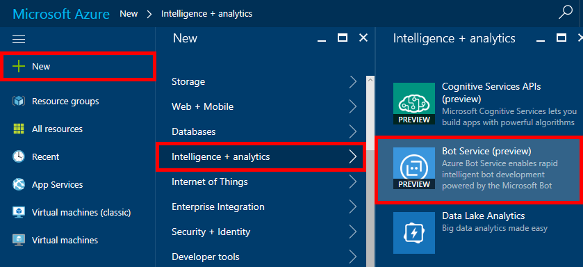

    _Creating a new Azure Bot Service_
  
1. Enter a name such as "qnafactbot" (without quotation marks) into the **App name** box. *This name must be unique within Azure, so make sure a green check mark appears next to it.* Make sure **Create new** is selected under **Resource Group** and enter the resource-group name "BotsResourceGroup" (again, without quotation marks). Then select the location nearest you and click **Create**. 

    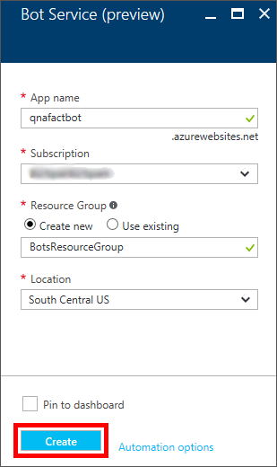

    _Configuring a new Azure Bot Service_
  
1. Click **Resource Groups** in the 
2.  on the left, followed by **BotsResourceGroup** to open the resource group created for the Bot Service.

    

    _Opening the resource group_
  
1. Wait until "Deploying" changes to "Succeeded" indicating that the Bot Service was successfully deployed. You can click the **Refresh** button at the top of the blade to refresh the deployment status.

    

    _Successful deployment_
  
1. Click **qnafactbot** (or the name you entered in Step 3) to open the App Service created for your bot.

    

    _Opening the Bot Service_
  
1. Click **Create Microsoft App ID and password**. If you are asked to sign in again, do so using your Microsoft account.

    

    _Creating an app ID and password_
  
1. Click **Generate an app password to continue**.

    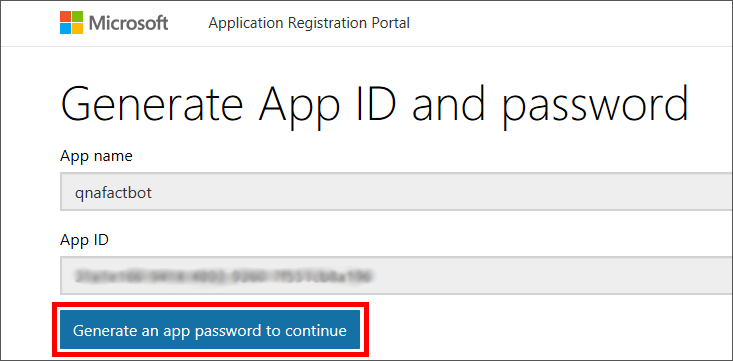

    _Generating an app password_
  
1. Copy the password to the clipboard. **You will not be able to retrieve this password after this step**, but will be required to use it in a later exercise. Once the password is saved, click **Ok** to dismiss the dialog.

    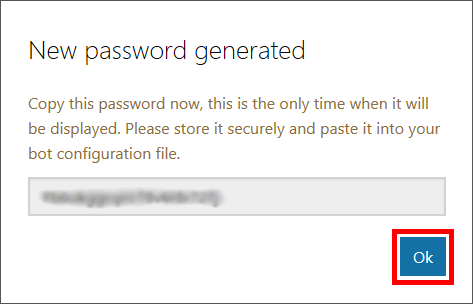

    _Copying the app password_
  
1. Review the application registration information, and then click **Finish and go back to Bot Framework**.

    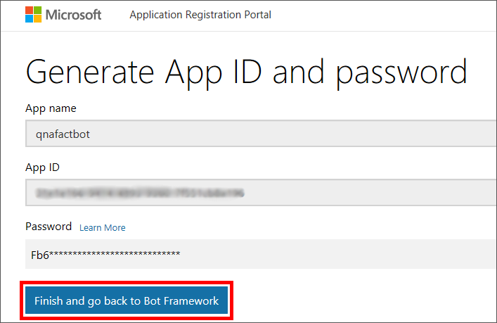

    _Finalizing the app registration_
  
1. Paste the password copied to the clipboard in Step 9 into the password box.

    

    _Pasting the app password_
  
1. Click **NodeJS**. Then click **Question and Answer** and click **Create bot**. If you are asked to sign in again, do so using your Microsoft account. Also, if you are asked for permission for QnA Maker to access your info, click **Yes**.

    

    _Selecting a language and template_

1. Check the **I agree** box, and then click **OK**. (If you are presented with the option of connecting to an existing knowledge base or creating a new one, choose the latter.) 

    

    _Connecting to QnA Maker_
  
1. After a brief pause, the Bot Service will open in the portal and display the Bot Service editor, as pictured below. Behind the scenes, the bot has been registered, an Azure Web App has been created to host it, and the bot has been connected to Microsoft QnA Maker.

    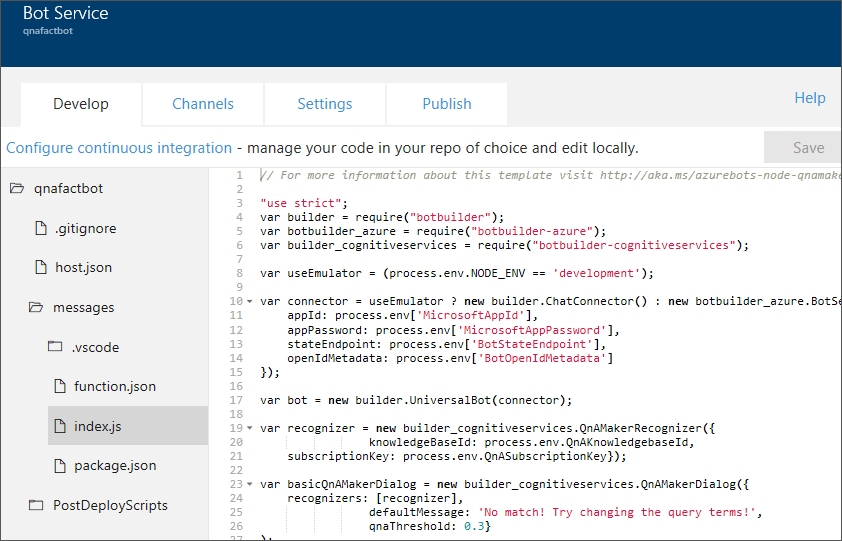

    _The Bot Service editor_  

1. To make sure these services can communicate with each other, you can test bot communication in the Azure Bot Service editor. To test, type the word "hi" (without quotation marks) into the chat window on the right side of the page. Then press **Enter** or click the paper-airplane icon.

    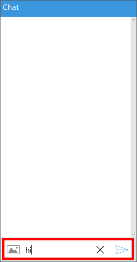

    _Testing bot communication_

1. Wait for the bot to respond with the word "hello," indicating your bot is configured and ready to go.

    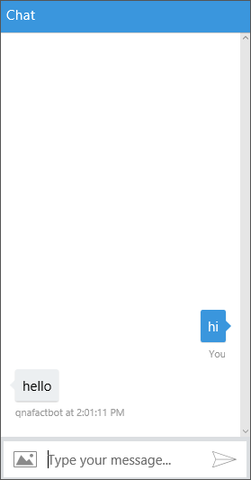

    _Chatting with your bot_

With the Bot Service deployed and configured, the next step is to update the Microsoft QnA Maker service that the bot is connected to.

<a name="Exercise2"></a>
## Exercise 2: Get started with Microsoft QnA Maker ##

[Microsoft QnA Maker](https://qnamaker.ai/) is part of [Microsoft Cognitive Services](https://www.microsoft.com/cognitive-services/), which is a suite of APIs for building intelligent apps. Rather than infuse a bot with intelligence by writing code that tries to anticipate every question a user might ask and provide a response, you can connect it to a knowledge base of questions and answers created with QnA Maker. A common usage scenario is to create a knowledge base from a FAQ so the bot can answer domain-specific questions such as "How do I find my Windows product key" or "Where can I download Visual Studio Code?"

In this exercise, you will use the QnA Maker portal to edit the knowledge base that was created when you connected the bot to QnA Maker. That knowledge base currently contains a single question and answer: "hi" and "hello." You will edit the response and then, in [Exercise 3](#Exercise3), populate the knowledge base with additional questions and answers.

1. Open the [Microsoft QnA Maker portal](https://qnamaker.ai/) in your browser. If you are not signed in, click **Sign in** in the upper-right corner and sign in with your Microsoft account. If you are presented with a terms agreement, check the **I agree** box and continue. 

    

    _Signing in to QnA Maker_

1. Ensure that **My services** is selected at the top. Then click the pencil icon.
 
    

    _Editing a QnA service_

1. Click **Settings**. Replace the value in the **Service name** box with "QnA Factbot" (without quotation marks). Then click **Save and retrain** to save the change. 
 
    

    _Updating the service name_

1. Click **Knowledge Base**.
 
    

    _Opening the Knowledge Base page_

1. Replace "hello" in the Answer column with "Welcome to the QnA Factbot!" Then click **Save and retrain** to save the change. 
 
    

    _Updating a response_

1. Click **Test**.
 
    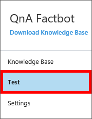

    _Opening the Test page_

1. Type "hi" into the box at the bottom of the chat window and press **Enter**. Confirm that the bot responds with "Welcome to the QnA Factbot!"
 
    

    _Chatting with the bot_

This is a great start, but a simple reply to the greeting "hi" doesn't demonstrate a lot of value. To give your bot some meaningful content to work with, the next step is to populate the knowledge base with additional questions and answers.

<a name="Exercise3"></a>
## Exercise 3: Expand the QnA Maker knowledge base ##

You can enter questions and answers into a QnA Maker knowledge base manually, or you can import them from a variety of sources, including Web sites and local text files. In this exercise, you will use both of these techniques to populate the knowledge base with questions and answers and then publish the updated knowledge base for your bot to use.

1. Click **Settings** to the return to the Settings page in the [Microsoft QnA Maker portal](https://qnamaker.ai/).
 
    

    _Opening the Settings page_

1. Paste the following URL into the **URLs** box:

	```
	https://traininglabservices.azurewebsites.net/help/faqs.html
	```

1. Click **Save and retrain** to populate the knowledge base with questions and answers from the Web site whose URL you provided.
 
    

    _Importing questions and answers from a URL_

1. Click **Knowledge Base** and confirm that six new questions and answers were added. Then click **Save and retrain** to save the changes.

    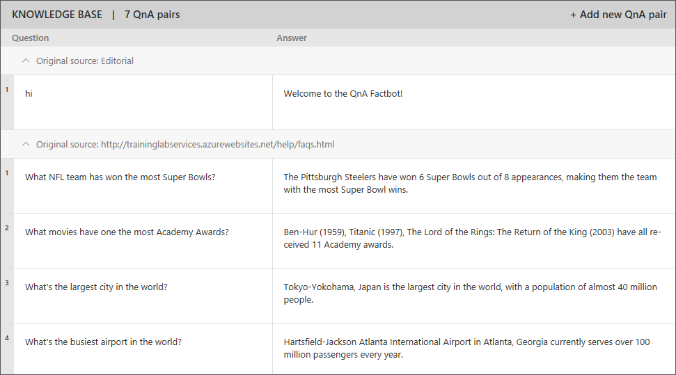

    _The updated knowledge base_

1. Click **Test** to return to the Test page. Type "What's the largest city in the world?" into the box at the bottom of the chat window and press **Enter**. Confirm that the bot responds as shown below.
 
    

    _Testing the updated knowledge base_

1. The knowledge base only contains a few questions and answers, but can easily be updated to include more. You can even import questions and answers stored in text files on your computer. To demonstrate, click **Replace Knowledge Base** in the upper-left corner of the portal.
 
    

    _Replacing the knowledge base_

1. Select the text file named **Final QnA.txt** included in the [resources that accompany this lab](https://a4r.blob.core.windows.net/public/bots-resources.zip). Click **OK** when prompted to confirm that importing this file will overwrite existing questions and answers.
 
1. Click **Knowledge Base** and confirm that 14 new questions and answers appear in the knowledge base. (The six you imported from the URL are still there, despite the fact that you were warned that they would be overwritten.) Then click **Save and retrain** to save the changes.

    

    _The updated knowledge base_

1. Click **Test** to return to the Test page. Type "What book has sold the most copies?" into the box at the bottom of the chat window and press **Enter**. Confirm that the bot responds as shown below. 
 
    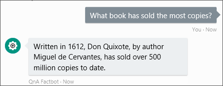

    _Chatting with the bot_

1. The knowledge base now contains 20 questions and answers, but an invalid character is present in the answer in row 7. To remove the character, click **Knowledge Base** to return to the Knowledge Base page. Locate the invalid character in row 7 between the words "most" and "Emmys," and replace it with a space character. Then click **Save and retrain**.
 
    

    _Editing answer #7_

1. Click **Publish** to publish the changes to the knowledge base.
 
    

    _Publishing the knowledge base_

1. Review the changes and click **Publish**. After a brief pause, you should be notified that the service has been deployed.
 
    

    _Reviewing changes_

With a sample knowledge base deployed, it is now time to lend attention to the bot itself.

<a name="Exercise4"></a>
## Exercise 4: Deploy the bot and set up continuous integration ##

When you deployed a Bot Service in [Exercise 1](#Exercise1), an Azure Web App was created to host the bot. But the bot still needs to be written and deployed to the Azure Web app. In this exercise, you will code the bot using source code generated for you by QnA Maker. Then you will create a local Git repository for the code, connect it to the Azure Web App, and publish the bot to Azure, all using Visual Studio Code.

1. If you haven't installed Visual Studio Code, take a moment to do so now. You can download Visual Studio Code from http://code.visualstudio.com. You should also install [Node.js](https://nodejs.org) and [Git Client](https://git-scm.com/downloads) if they aren't already installed. All of these products work cross-platform and can be installed on Windows, macOS, or Linux.

	> An easy way to determine whether Node.js is installed is to open a terminal window or Command Prompt window and execute a **node -v** command. If the Node.js version number is displayed, then Node.js is installed.

1. Return to the Azure Portal and open the Bot Service you created in [Exercise 1](#Exercise1) if it isn't already open.

    

    _Opening the Bot Service_
  
1. Click **Settings**, and then click **Configure**.

    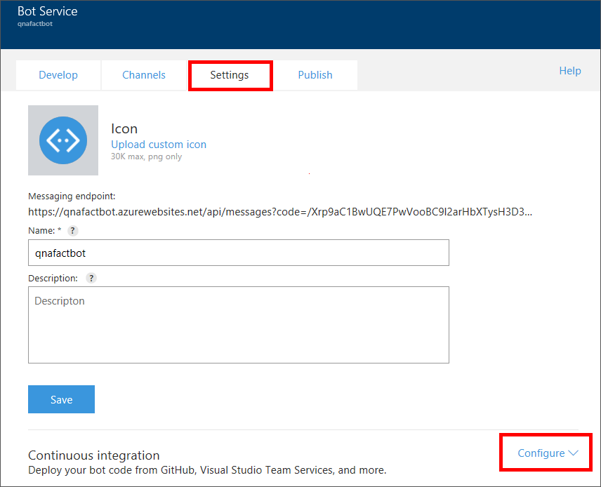

    _Configuring continuous integration_
  
1. Click the link to the zip file containing source code. Once the download is complete, unzip the zip file and copy its contents to the local folder of your choice.

    

    _Downloading the source code_
  
1. Scroll down the page and click the **Open** button to the right of "Advanced Settings."

    

    _Opening advanced settings_  

1. Click **Deployment credentials**.

    

    _Viewing deployment credentials_  

1. Enter a user name such as "BotAdministrator" (you will probably have to enter a different user name since these must be unique within Azure) and enter "Password_1" as the password. Click **Save** to save your changes. Then close the blade by clicking the **x** in the upper-right corner.

    

    _Entering deployment credentials_  

1. Click **Set up integration source**.
 
    

    _Setting up an integration source_  

1. Click **Setup**, followed by **Choose Source**.
 
    

    _Choosing a deployment source_  

1. Select **Local Git Repository** as the deployment source, and then click **OK**. 
 
    

    _Specifying a local Git repository as the deployment source_  

1. Start Visual Studio Code. Select **Open Folder** from the **File** menu and browse to the folder to which you copied the contents of the zip file downloaded in Step 4. Then select the "messages" folder and click **Select Folder**.
 
    

    _Selecting the "messages" folder_  

1. Click the **Git** button in the View Bar on the left side of Visual Studio Code, and then click **Initialize Git Repository**. This will initialize a local Git repository for the project.

    

    _Initializing a local Git repository_  

1. Type "First commit" into the message box, and then click the check mark to commit your changes.

    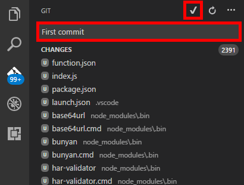

    _Committing changes to the local Git repository_  

1. Use Visual Studio Code's **View -> Integrated Terminal** command to open an integrated terminal window. Execute the following command in the integrated terminal, replacing "BOT_APP_NAME" in two places with the name of the Bot Service you entered in [Exercise 1](#Exercise1), Step 3.

	```
	git remote add qnafactbot https://BOT_APP_NAME.scm.azurewebsites.net:443/BOT_APP_NAME.git
	```

1. Select **Command Palette** from the **View** menu to open Visual Studio Code's command palette. Then type "git pub" into the command palette and select **Git: Publish** to publish the bot code to Azure. 

    

    _Publishing the bot_  

1. If prompted to confirm that you want to publish, click **Publish**.

    

    _Confirming Git publishing_ 

1. If prompted for credentials, enter the user name and password ("Password_1") you specified in Step 7 of this exercise.

    

    _Entering deployment credentials_ 

1. Wait until your bot code has been published. A clock will appear over the Git button in the View Bar while publishing is in progress, and disappear when publishing is complete.

    

    _The Git publishing indicator_ 

In this exercise, you created a project for your bot in Visual Studio Code and set up continuous integration using Git to simplify publishing code changes. Your bot has been published to Azure and it's time to see it in action and learn how to debug it in Visual Studio Code.

<a name="Exercise5"></a>
## Exercise 5: Debug the bot locally ##

As with any application code that you write, changes to bot code need to be tested and debugged locally before being deployed to production. To help debug bots, Microsoft offers the [Bot Framework Emulator](https://emulator.botframework.com/). In this exercise, you will learn how to use Visual Studio Code and the Bot Framework Emulator to debug your bots.

1. If you haven't installed the Microsoft Bot Framework Emulator, take a moment to do so now. You can download it from https://emulator.botframework.com/.

1. Click the **Explorer** button in Visual Studio Code's View Bar. Then select **index.js** to open it in the code editor. This file contains the code that drives the bot — code that was generated by QnA Maker and downloaded from the QnA Maker portal.

    

    _Opening index.js_ 

1. Replace the contents of **index.js** with the following code:

	```JavaScript
	"use strict";
	var builder = require("botbuilder");
	var botbuilder_azure = require("botbuilder-azure");
	
	var useEmulator = (process.env.NODE_ENV == 'development');
	
	var connector = useEmulator ? new builder.ChatConnector() : new botbuilder_azure.BotServiceConnector({
	    appId: process.env['MicrosoftAppId'],
	    appPassword: process.env['MicrosoftAppPassword'],
	    stateEndpoint: process.env['BotStateEndpoint'],
	    openIdMetadata: process.env['BotOpenIdMetadata']
	});
	
	var bot = new builder.UniversalBot(connector);
	
	bot.dialog('/', [
	
	function (session) {
	    builder.Prompts.text(session, "Hello, and welcome to QnA Factbot! What's your name?");
	},
	
	function (session, results) {
	
	    session.userData.name = results.response;
	    builder.Prompts.number(session, "Hi " + results.response + ", how many years have you been writing code?"); 
	},
	
	function (session, results) {
	
	    session.userData.yearsCoding = results.response;
	    builder.Prompts.choice(session, "What language do you love the most?", ["C#", "JavaScript", "TypeScript", "Visual FoxPro"]);
	},
	
	function (session, results) {
	
	    session.userData.language = results.response.entity;   
	
	    session.send("Okay, " + session.userData.name + ", I think I've got it:" +
	                " You've been writing code for " + session.userData.yearsCoding + " years," +
	                " and prefer to use " + session.userData.language + ".");
	}]);
	
	if (useEmulator) {
	    var restify = require('restify');
	    var server = restify.createServer();
	    server.listen(3978, function() {
	        console.log('test bot endpoint at http://localhost:3978/api/messages');
	    });
	    server.post('/api/messages', connector.listen());    
	} else {
	    module.exports = { default: connector.listen() }
	}
	
	```

1. Note the Bot Builder prompts on lines 19, 25, and 31. Set a breakpoint on each of these lines by clicking in the margin on the left.
 
    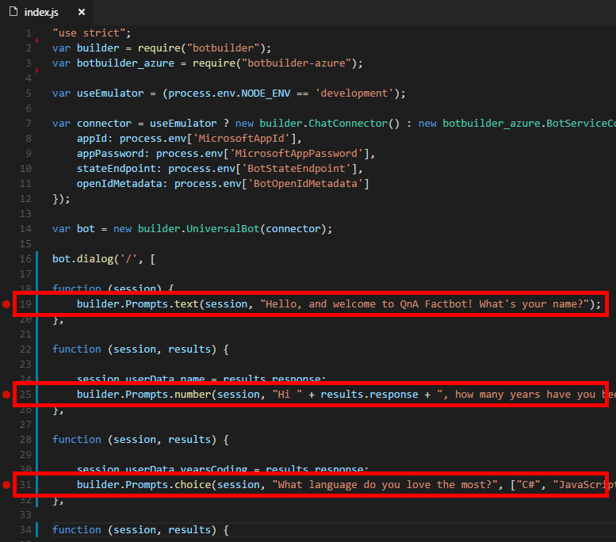

    _Adding breakpoints to index.js_ 

1. Click the **Debug** button in the View Bar, and then click the green arrow to start a debugging session. Observe that "test bot endpoint at http://localhost:3978/api/messages" appears in the debug console.
 
    

    _Launching the debugger_ 

1. Your bot code is now running locally. Launch the Bot Framework Emulator and type the following URL into the box at the top of the window:

	```
	http://localhost:3978/api/messages
	```

1. Leave **Microsoft App ID** and **Microsoft App Password** blank for now, and click **CONNECT** to connect the emulator to the debugging session.
 
    

    _Connecting the emulator to the debugging session_ 

1. Type "Hi" (without quotation marks) into the box at the bottom of the emulator and press **Enter**. Visual Studio Code will break on line 19 of **index.js**. 
 
    

    _Chatting with the bot_
 
1. Click the **Continue** button in Visual Studio Code's debugging toolbar and return to the emulator to see the bot's response.
 
    

    _Continuing in the debugger_ 

1. Continue through the guided bot conversation, answering each question and clicking **Continue** in Visual Studio Code each time a breakpoint is hit.
 
    

    _A guided bot conversation_

1. Click the **Stop** button in Visual Studio Code's debugging toolbar to end the debugging session.

At this point, you have a fully functioning bot and know how to debug it by launching it in the debugger in Visual Studio Code and connecting to the debugging session from the Microsoft Bot Emulator. The next step is to make the bot more intelligent by connecting it to the knowledge base you deployed in [Exercise 3](#Exercise3).

<a name="Exercise6"></a>
## Exercise 6: Connect the bot to the knowledge base ##

In this exercise, you will connect your bot to the QnA Maker knowledge base you built earlier so the bot can converse more intelligently. This involves retrieving a couple of keys from the Azure Portal, copying them into a configuration file in the bot project, and redeploying the bot to Azure.

1. In Visual Studio Code, click the **Explorer** button and select **index.js** if it isn't already selected.

    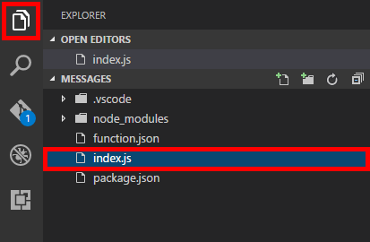

    _Opening index.js_ 

1. Click the **Debug** button in the View Bar. Then click the **Remove All Breakpoints** icon to clear the breakpoints you added earlier.

    

    _Removing all breakpoints_ 

1. Replace the contents of **index.js** with the following code:

	```JavaScript
	// For more information about this template visit http://aka.ms/azurebots-node-qnamaker
	
	"use strict";
	var builder = require("botbuilder");
	var botbuilder_azure = require("botbuilder-azure");
	var builder_cognitiveservices = require("botbuilder-cognitiveservices");
	
	var useEmulator = (process.env.NODE_ENV == 'development');
	
	var connector = useEmulator ? new builder.ChatConnector() : new botbuilder_azure.BotServiceConnector({
	    appId: process.env['MicrosoftAppId'],
	    appPassword: process.env['MicrosoftAppPassword'],
	    stateEndpoint: process.env['BotStateEndpoint'],
	    openIdMetadata: process.env['BotOpenIdMetadata']
	});
	
	var bot = new builder.UniversalBot(connector);
	
	var recognizer = new builder_cognitiveservices.QnAMakerRecognizer({
	                knowledgeBaseId: process.env.QnAKnowledgebaseId, 
	    subscriptionKey: process.env.QnASubscriptionKey});
	
	var basicQnAMakerDialog = new builder_cognitiveservices.QnAMakerDialog({
	    recognizers: [recognizer],
	                defaultMessage: 'No match! Try changing the query terms!',
	                qnaThreshold: 0.3}
	);
	
	
	bot.dialog('/', basicQnAMakerDialog);
	
	if (useEmulator) {
	    var restify = require('restify');
	    var server = restify.createServer();
	    server.listen(3978, function() {
	        console.log('test bot endpoint at http://localhost:3978/api/messages');
	    });
	    server.post('/api/messages', connector.listen());    
	} else {
	    module.exports = { default: connector.listen() }
	}
	```

1. Observe the call to *QnAMakerDialog* on line 23. This creates a dialog that integrates a bot built with the Microsoft Bot Framework with a knowledge base built Microsoft QnA Maker.
 
    

    _Creating a QnAMakerDialog_ 

1. Expand the **.vscode** folder in Explorer and select **launch.json** to open it for editing. Note the empty-string values for "QnAKnowledgebaseId" and "QnASubscriptionKey." To connect the bot to the knowledge base, you must replace the empty strings with a pair of keys generated by the Bot Service.
 
    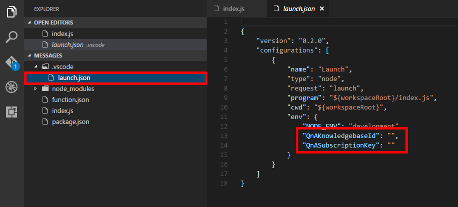

    _Opening launch.json_ 

1. Return to the Azure Portal and open your Bot Service if it isn't already open. Then click the **Settings** tab. 

    

    _Opening the Settings page_
 
1. Click **Open** to the right of "Application settings."

    

    _Viewing application settings_
 
1. Scroll down until you find the application setting named "QnAKnowledgebaseId" and copy its value to the clipboard.

    

    _Copying the knowledge-base ID_ 
 
1. Return to Visual Studio Code and paste the value on the clipboard into the value for "QnAKnowledgebaseId."

    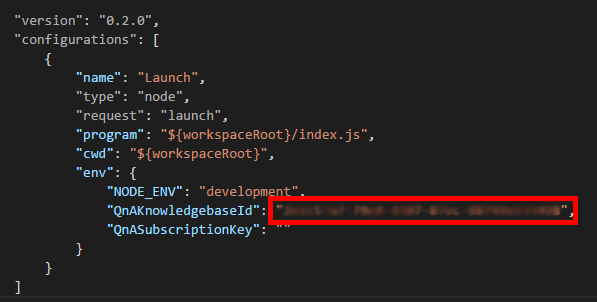

    _Updating "QnAKnowledgebaseId" in launch.json_ 

1. Repeat this process to copy the value of the application setting named "QnASubscriptionKey" from the portal to **launch.json**.

1. Start a new debugging session in Visual Studio Code. Then launch the Bot Framework Emulator if it isn't already running and enter the following endpoint URL again:

	```
	http://localhost:3978/api/messages
	```

1. Remember to leave the **Microsoft App ID** and **Microsoft App Password** boxes empty, and click **CONNECT** to reconnect the emulator to the debugging session.

1. In the emulator, click the **Refresh** icon to start a new conversation.

    

    _Starting a new conversation in the emulator_

1. Type "What's the most popular software programming language in the world?" into the box at the bottom of the emulator chat window and press **Enter**.

    

    _Chatting with the bot_

1. Observe that the responses are now based on the QnA knowledge base. Ask the bot additional questions and see how it responds. For example, ask it what is the best-selling multiplatform game of all time, or who won the Super Bowl.

1. Click the **Stop** button in Visual Studio Code's debugging toolbar to end the debugging session. Then select **View  -> Command Palette** to open the command palette, type "Git Sy," and select **Git: Sync**.

	

    _Syncing the local and remote repositories_  

1. If Visual Studio Code prompts you with a Git synchronization warning, click **OK**.

	

    _Dismissing the synchronization warning_  

Now that your bot has been written, updated, and tested, the final step is to test it outside the debugger in a connected channel.

<a name="Exercise7"></a>
## Exercise 7: Test the bot with Skype ##

Once deployed, bots can be connected to channels such as Skype, Slack, Microsoft Teams, and Facebook Messenger, where you can interact with them the way you would interact with any other user. In this exercise, you will test your bot with Skype.

1. If Skype isn't already installed on your computer, please install it now. You can download Skype for Windows, macOS, and Linux from https://www.skype.com/en/download-skype/skype-for-computer/.

1. Return to your Bot Service in the Azure Portal and click **Channels**. 

    

    _Opening the Channels page_
 
1. Click **Edit** in the "Skype" row.

    

    _Editing the Skype channel_
 
1. Ensure that the bot is enabled on Skype and click **I'm done configuring** at the bottom of the page. Your bot is now ready to test in a Skype conversation.

    

    _Enabling Skype integration_
 
1. Click the **Add to Skype** button.
 
    

    _Adding the bot to Skype_
 
1.  Click **Add to Contacts** to add the bot as a Skype contact. Skype will launch and display a new conversation thread between you and the bot. 
  
	> If Skype does not automatically initiate a conversation with the bot, select the bot from the "Recent" list in Skype to initiate a conversation manually. 
	
    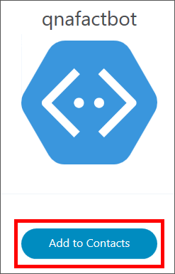

    _Adding the bot as a Skype contact_
	
1. Start a conversation with the bot by typing "hi" into the Skype window.The bot will display a welcome message and you can start a question-and-answer process using the information available in your QnA knowledge base!   	
 
    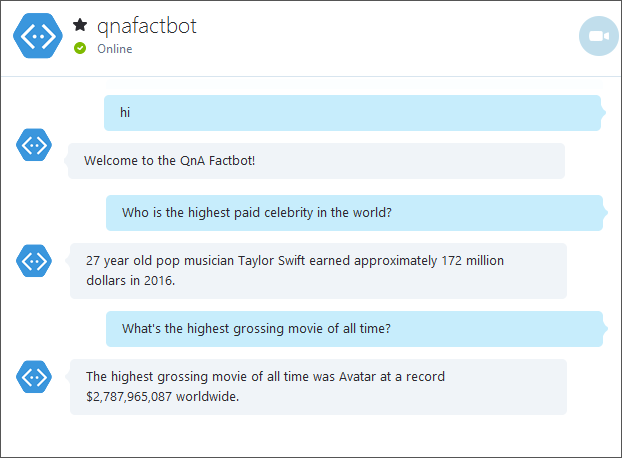

    _Chatting with the bot in Skype_

You now have a fully functional bot created with the Microsoft Bot Framework, infused with intellgience with Microsoft QnA Maker, and available for anyone in the world to interact with. Feel free to plug your bot into other channels and test it in different scenarios. And if you would like to make the bot smarter, consider expanding the QnA knowledge base with additional questions and answers. For example, you could use the [online FAQ](https://docs.botframework.com/en-us/faq/) for the Bot Framework to train the bot to answer questions about the framework itself.

<a name="Summary"></a>
## Summary ##

In this hands-on lab you learned how to:

- Create an Azure Bot Service to host a bot
- Create a Microsoft QnA knowledge base, populate it with data, and connect it to a bot
- Implement bots in code and debug the bots that you build
- Publish bots and use continuous integration to keep them up to date
- Plug a bot into Skype and interact with it there

There is much more that you can do to leverage the power of the Microsoft Bot Framework by incorporating [dialogs](http://aihelpwebsite.com/Blog/EntryId/9/Introduction-To-Using-Dialogs-With-The-Microsoft-Bot-Framework), [FormFlow](https://blogs.msdn.microsoft.com/uk_faculty_connection/2016/07/14/building-a-microsoft-bot-using-microsoft-bot-framework-using-formflow/), and [Microsoft Language Understanding and Intelligence Services (LUIS)](https://docs.botframework.com/en-us/node/builder/guides/understanding-natural-language/). With these and other features, you can build sophisticated bots that respond to users' queries and commands and interact in a fluid, conversational, and non-linear manner. For more information, see https://blogs.msdn.microsoft.com/uk_faculty_connection/2016/04/05/what-is-microsoft-bot-framework-overview/.

----

Copyright 2016 Microsoft Corporation. All rights reserved. Except where otherwise noted, these materials are licensed under the terms of the MIT License. You may use them according to the license as is most appropriate for your project. The terms of this license can be found at https://opensource.org/licenses/MIT.